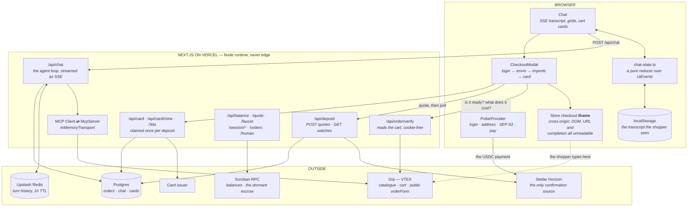
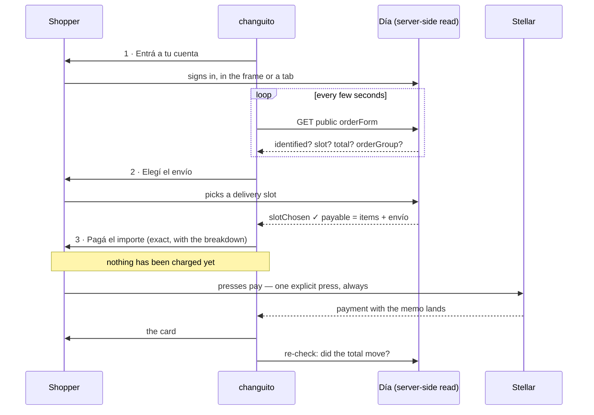
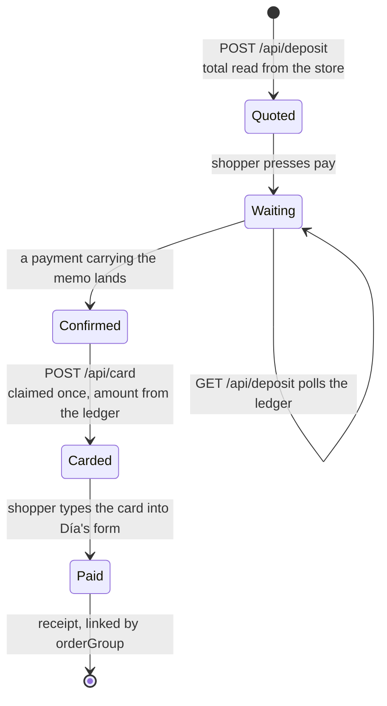
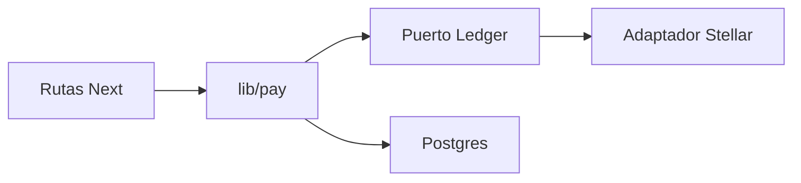

# Architecture

## Overview

changuito is four things that happen to live in one repository:

1. **An MCP server** (`packages/mcp`) that speaks to four Argentine VTEX
   supermarkets — search, price check, cart building, and a link that opens that
   exact cart on the store's own site. It was written first, as a standalone
   server for chat clients.
2. **An agent** (`apps/web/lib/agent`) that drives it. A streaming Anthropic
   tool loop with the MCP server's ten tools on one side and a handful of
   display-only tools on the other.
3. **A payment rail** (`lib/pay`, `lib/ledger`, thin `/api/deposit` and
   `/api/card`) — a classic Stellar payment identified by a memo, confirmed
   through the ledger port (Horizon today), which unlocks a card the shopper
   types into the store's own payment form.
4. **A Soroban escrow** (`contracts/escrow`) that held USDC between "the user
   approved this basket" and "the basket actually happened". Deployed, tested,
   and **dormant**: see [Why the escrow is not on the rail](#why-the-escrow-is-not-on-the-rail).

The app is the reason the first two exist: the MCP server had never been used by
anything except a chat client, and this proves it works inside a product.

## Two products in one bundle

The line between them is **whether Pollar has a session** — not a toggle, not an
environment variable somebody can set wrong. Signing in *is* the crossing, and
the network is the consequence rather than a separate choice.

| | Signed out | Signed in |
|---|---|---|
| mode | `preview` | `production` |
| network | testnet | mainnet |
| who pays | we do, from a wallet we hold | they do, from theirs |
| the card | funded for exactly this basket, used once, terminated | one per customer, kept, topped up by each deposit |
| records | not kept | kept |

`lib/app-mode.ts` owns the map in both directions and nothing else derives it
independently. Deriving the mode from the session deletes a whole class of bug:
the mode cannot disagree with who you are, and no server route has to
re-litigate a "modo real" preference against the identity it can actually see.

## System diagram



---

## The pieces, and why they are shaped that way

### The cross-origin wall is the central constraint

The store's checkout runs in an iframe. The app cannot read its DOM, its URL, or
whether it finished — and that is not a bug to work around, it is the security
boundary doing its job. Two consequences shape everything downstream:

1. **Every reading of the shopper's cart is taken server-side**, from VTEX's
   *public* `orderForm` endpoint (`/api/checkout/pub/orderForm/{id}`), with no
   cookies. `lib/order-check.ts` is the only thing that touches it. It answers
   four questions and nothing else: is somebody signed in, has a delivery slot
   been picked, what is the exact payable total with its breakdown, and does an
   `orderGroup` exist yet.
2. **`orderGroup` is the one unambiguous success signal.** VTEX serves
   `/checkout` with no `x-frame-options` but serves the order-confirmation page
   with `SAMEORIGIN`, so a successful purchase ends with the browser refusing to
   draw the last page. The cart document is where the order id can still be read.

**Nothing about the shopper leaves that read.** The endpoint returns their email,
name and DNI unmasked to anyone holding a cart id. `OrderFormState` carries nine
fields, none of them personal, and `lib/test/order-check.test.ts` asserts against
fixtures that contain all three secrets that none of them appear in the output —
including the classifier's own `why` string, which embeds the orderGroup, and its
`problems` array, which embeds store messages and item names.

**The iframe is mounted once and never unmounted.** Re-mounting reloads the
store's checkout and loses whatever the shopper typed, so the three-step rail is
a change to the *panel above* the frame, never a change of screen.

### The order of the three steps is the design



Before commit `16ee1a8` this ran the other way: the deposit was quoted on mount
from `cart.total`, which is the goods subtotal *by design*, so the shopper was
charged a number that excluded envío and the only thing absorbing the difference
was an FX buffer sized for rate drift. Nothing is quoted now until the store
itself says what the basket costs.

Two rules survive from that change and should not be undone:

- **The charge is only ever an explicit press.** What became automatic is
  *reading the total*, never *taking the money*.
- **If the total moves after the quote, both numbers are named** and no second
  charge happens and no refund is issued automatically. The card is still shown,
  because refusing it would strand someone mid-payment with money already sent.

### The MCP server runs in-process, over a real transport

`lib/mcp/boot.ts` creates an MCP `Client` and an `McpServer` and links them with
`InMemoryTransport.createLinkedPair()`. That is the actual protocol —
`initialize`, `tools/list`, `tools/call` — with a pair of queues instead of a
pipe.

Importing the tool functions and calling them directly would be shorter, and
would defeat the purpose: the point of this app is to demonstrate what the MCP
server does, so the protocol has to be on the wire.

Spawning the published binary as a subprocess would also be real MCP, but the
binary registers the checkout tools, which open a **headed browser on the server
host** so a human can type their supermarket password. That cannot run on Vercel.
`@changuito/mcp/server` is the half that can, and it has no path to the checkout
module at all — the checkout tools sit behind a dynamic `import()`, so nothing in
the web app's import graph can even resolve Playwright.

The ten tools the agent sees: `list_retailers`, `set_location`,
`search_products`, `get_product`, `price_check`, `add_to_cart`,
`update_cart_item`, `view_cart`, `get_cart_link`, `where_am_i`.

### Two kinds of tool, and the split is the design

The MCP tools answer *what the data is*. A second set —
`apps/web/lib/agent/render-tools.ts` — answers *what to show*, never leaves the
process, and emits a UI event instead of calling anything.

The reason is that a search result is not a recommendation. `search_products`
returns twelve items whether the model recommends three of them or none, so
*which ones to surface* is a decision, and a decision has to be a call.

**Render tools take identifiers only** — never a price, never a name. The model
picks SKUs; the server looks up what they cost in a per-conversation cache. A
hallucinated price has no argument to travel in. That matters most directly above
a button that spends money.

The cart is the exception, and the exception is principled: there is exactly one
cart, the user built it, and its current contents are not a choice anybody is
making. It draws itself after every tool, fingerprinted so an unchanged basket
does not redraw. [`../CLAUDE.md`](../CLAUDE.md) §2 has the two opposite bugs that
produced that rule.

### Three stores hold a conversation, and they are not redundant

| State | Lives in | Because |
|---|---|---|
| MCP session (postal code, sales channel, cart id) | a **snapshot the browser holds** and sends back each turn, plus a warm `Map` for speed | it is small, it is stable, and there is nothing in it the user does not already have — the cart id is handed to them as a URL |
| Conversation history (messages, product cache) | **Upstash Redis**, keyed by session, 1h TTL | it is the working store the hop loop reads up to twelve times a turn, and it grows every hop, so it cannot ride in a request body |
| The transcript the shopper sees | **localStorage** (`chat-store.ts`) | it is theirs, it must survive a reload, and a chat the server can no longer continue comes back **read-only** rather than pretending |
| The record | **Postgres** (`chat-archive.ts`, `db.ts`) | it outlives the Redis TTL, survives a cleared browser, and is what an order is joined back to |

Both server-side stores exist because a Vercel lambda's module scope is a cache,
not a database: instances are recycled on deploy, on idle and on scale-out, and
two messages from the same user can land on different ones. With no Redis
configured the history falls back to an in-process `Map`, which on one
developer's machine is the same guarantee for free.

**The archive is only for a signed-in wallet.** `chat.address` is `not null` and
that is enforcement rather than oversight: a transcript is a list of what
somebody bought and usually carries their postal code, so moving it from an hour
in a cache to durable storage is a real change in exposure. Reads are narrowed
the same way, in the `WHERE` clause — a chat id is a UUID, not a capability.

Both writes happen **only after a clean return**. A turn that threw mid-hop can
leave an assistant `tool_use` with no matching `tool_result`, and the API rejects
that pairing on the *next* request — so a transcript archived in that state is a
permanent copy of something the API refuses.

### Everything Stellar is server-side except the signature and the payment

`@stellar/stellar-sdk` never enters the client bundle. The browser reads balances
through `/api/balance` and prices a basket through `/api/quote`. What it does
itself is sign — a SEP-53 message proving the address, and the payment that moves
the money — because those signatures *are* the authorization.

---

## The money rail



The quote, the confirmation and the card read the chain through one port —
`activeLedger()` in `lib/ledger/`. Routes under `/api/deposit` and `/api/card`
are thin: they translate HTTP. The use cases live in `lib/pay/`. Today the
port's only adapter is classic Stellar via Horizon; it holds no signing key.
Postgres stays a direct call — the once-only card claim is a conditional
`UPDATE`, not a second ledger. A second chain would replace the adapter behind
the same port; the shop and the iframe would not move.



Four properties worth naming:

1. **The amount is never the client's figure.** `/api/deposit` prefers the total
   it reads from the store; `/api/card` derives the amount from the payment that
   actually landed. A figure sent by a client is a figure a client chose.
2. **Confirmation is a public read.** The ledger port answers — today that is
   Horizon — with no webhook to miss, no secret to hold, nothing to reconcile.
   Anyone can check a deposit themselves. Matching is pure arithmetic over
   payment records (`lib/ledger/match.ts`); the adapter only fetches. The
   money bugs live in the matcher (an off-by-one on the amount, a memo compared
   case-sensitively, the wrong asset accepted because native has no issuer),
   and that file is what the tests pin.
3. **A deposit buys exactly one card.** The claim is a conditional `UPDATE …
   where card_id is null`, not a read followed by a write, because two tabs
   pressing the button together is the ordinary case and not the adversarial one.
4. **The PAN and CVV go from the issuer to the screen and stop.** Not a log line,
   not localStorage, not a Playwright trace. The client registers both with a
   redactor on arrival, so even a careless log elsewhere cannot print them.

### Why the escrow is not on the rail

The escrow is deployed on testnet, has 19 tests, and is reachable from `/dev/ui`.
It is not what the shopper's path uses, for two reasons that are worth separating:

- **Scope.** What the order needs is smaller than an escrow: the money has to
  arrive before a card is issued against it. A classic payment with a memo does
  that with no contract, no resolver key in the production deployment, and
  nothing deployed on mainnet at all.
- **Honesty about settlement.** An escrow's `settle` needs proof the basket
  happened. Behind the cross-origin wall the app's only source for that was the
  shopper's own word, and an escrow that settles on the buyer's word is a
  custodial box with extra steps.

The second reason is the one that has since weakened: `orderGroup` is real
evidence, read server-side from the store's own document. Wiring it to `settle`
is the honest next step. [stellar.md](stellar.md#the-escrow-contract-dormant)
carries the rest.

---

## Trust boundaries

```
   the shopper       │  the app's backend      │  the public ledger
   ──────────────────┼─────────────────────────┼──────────────────────────
   signs SEP-53      │  verifies it            │  records the payment
   sends the payment │  reads Horizon          │  anyone can read it back
   types the card    │  never stores the PAN   │
                     │  issues no refund       │
                     │  automatically          │
```

**In production the backend holds no Stellar signing key.** The deposit rail
needs an address to receive at, not a key to spend with, so a compromise of the
deployment cannot move a shopper's money — it can at worst quote wrong, which the
shopper sees before pressing anything. The testnet faucet and the escrow do use
`STELLAR_RESOLVER_SECRET`, read at call time rather than import time, so a build
without it still succeeds and only the routes that sign fail.

**Every gate that can spend real money checks a signature, not a claim.** Four of
them share one shape on purpose — `deposit-gate.ts`, `network-access.ts`,
`faucet-auth.ts`, `settle-gate.ts` — because two gates answering the same
question in two shapes is how one of them ends up wrong. The allowlist is checked
against an address already proven by a SEP-53 signature, never one the browser
merely claims. `REAL_MODE_OPEN_TO_ALL` drops the allowlist; it does **not** drop
the signature, because "anybody may pay" and "nobody has to prove who they are"
are different sentences and only the first was ever asked for.

**Deny by default.** In production an empty allowlist means nobody, which also
covers Vercel previews, since those run as production too. Testnet is never
gated; it is the default and it cannot spend anything.

---

## Repository layout

```
changuito/
├── apps/web/                Next.js shopper — the agent, the UI, the API routes
│   ├── app/api/             chat (SSE), deposit, card, order, balance, quote,
│   │                          faucet, session, orders, network, human, settle
│   ├── app/dev/             fixtures: /dev/ui (component gallery, the escrow
│   │                          panel) and /dev/checkout (the rehearsal store)
│   ├── components/          Chat, CheckoutModal, CardPanel, CartRail,
│   │                          WalletWidget, HumanGate, Purchases, …
│   └── lib/
│       ├── agent/           loop, prompt, render-tools, turn-store, early-ask,
│       │                     providers/ (the one model interface)
│       ├── mcp/             boot (in-memory transport), bridge, session
│       ├── ledger/          the deposit port; Stellar adapter; pure matcher
│       ├── pay/             quote, confirm, issue card — no chain SDK
│       ├── server/          the resolver key — server-only
│       ├── chat-state.ts    the transcript reducer
│       ├── order-check.ts   the server-side read of the shopper's cart
│       ├── deposit*.ts      address, memo, gate; deposit-watch is a facade
│       ├── card.ts          issuing, claiming, and never writing the PAN down
│       ├── db.ts            orders, cards, chats — one place, plain SQL
│       └── stellar.ts       RPC, Horizon, friendbot, unit maths, explorer links
├── apps/landing/            marketing site for www.changuito.me
├── apps/branding/           brand kit, sibling of the two apps (not a package)
├── contracts/
│   ├── escrow/              open, settle, refund, events — 19 tests, dormant
│   └── mock_usdc/           SEP-41 token, admin-gated mint — 15 tests
├── packages/
│   ├── mcp/                 the vendored MCP server — 520 tests
│   ├── trust/               footer copy shared by both apps, so they cannot drift
│   ├── escrow-bindings/     generated from the deployed wasm
│   └── usdc-bindings/       generated from the deployed wasm
├── supabase/migrations/     orders, chat, card_owner, shared_card
├── e2e/                     Playwright: the checkout, and live-site smoke
├── scripts/                 deploy.sh, setup-demo-asset, db migrate + invariants
└── deployments.json         contract ids and accounts, written by the script
```
